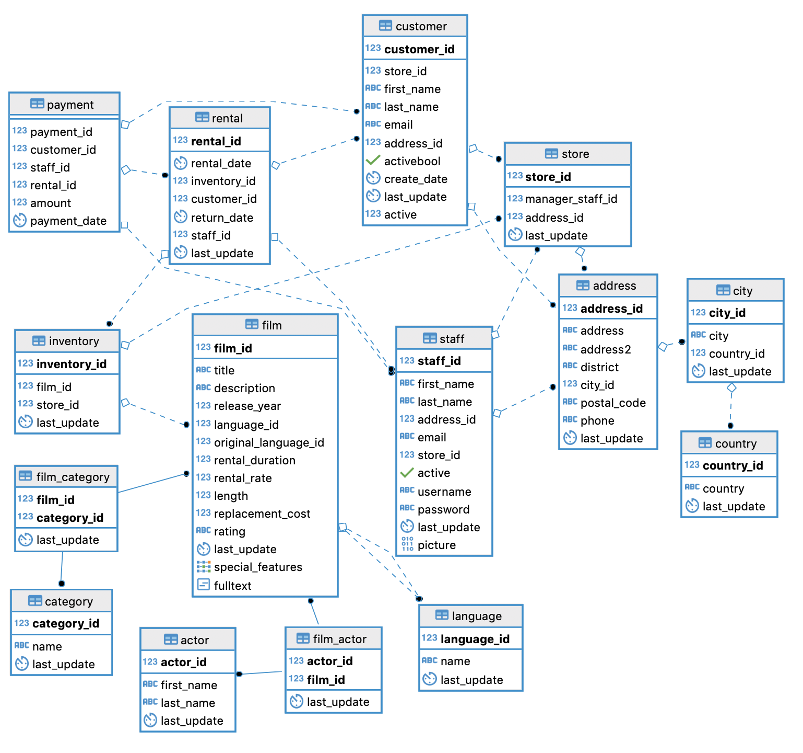

# Pagila ETL project
[Pagila](https://github.com/devrimgunduz/pagila
) is a port of the [Sakila](https://dev.mysql.com/doc/sakila/en/) example database available for MySQL.

In this project, I'm going to extract the pagila data, transform to star schema before loading into target data warehouse supporting [slowly changing dimensions type 2](https://en.wikipedia.org/wiki/Slowly_changing_dimension). 

## Create a database

1. `psql -c "CREATE DATABASE pagila;"`
2. `psql -d pagila -f source/pagila-schema.sql`
3. `psql -d pagila -f source/pagila-data.sql`

## Extract, transform and load

1. `psql -d pagila -f etl/create_dwh.sql`
2. `psql -d pagila -f etl/etl.sql`
